# Modelo de datos — SIGECOP

**Proyecto:** SIGECOP — Gestión de Contratos de Obra Pública
**Motor:** PostgreSQL · **Origen:** esquema real del sistema (`backend/src/db/schema.sql`)
**Contenido:** diagrama entidad-relación, entidades por dominio, relaciones con cardinalidad y diccionario de datos.

> Modelo derivado del esquema **real** en producción (38 tablas, 3 catálogos/enumeraciones, 14 reglas de
> inmutabilidad). El diseño parte del **contrato como entidad central** y lo divide en secciones (catálogo, programa,
> garantías, bitácora, estimaciones, convenios, pago, finiquito), con **históricos 1:N** para sustituciones y
> versiones, como pidió la revisión del modelo de datos.

---

## 1. Diagrama entidad-relación (vista general)

```mermaid
erDiagram
  USUARIOS ||--o{ CONTRATOS : "crea / asigna (5 punteros)"
  EMPRESAS ||--o{ USUARIOS : "pertenece"
  EMPRESAS ||--o{ CONTRATOS : "contratista / supervisión"
  CONTRATOS ||--o{ CONTRATO_CONCEPTOS : "catálogo"
  CONTRATOS ||--o{ CONTRATO_PERIODOS : "calendario"
  CONTRATO_CONCEPTOS ||--o{ PROGRAMA_OBRA : "celda"
  CONTRATO_PERIODOS  ||--o{ PROGRAMA_OBRA : "celda"
  CONTRATOS ||--o{ CONTRATO_GARANTIAS : "fianzas"
  CONTRATO_GARANTIAS ||--o{ GARANTIA_ENDOSOS : "endosos"
  CONTRATOS ||--o{ CONTRATO_DOCUMENTOS : "PDFs"
  CONTRATOS ||--o{ PLAN_AMORTIZACION : "anticipo"
  CONTRATOS ||--o{ CONTRATO_ROSTER : "roster histórico"
  CONTRATO_ROSTER ||--o{ CONTRATO_ROSTER : "sustituye_a"
  CONTRATOS ||--|| BITACORA_APERTURAS : "1:1"
  BITACORA_APERTURAS ||--o{ BITACORA_NOTAS : "notas"
  BITACORA_NOTA_TIPOS ||--o{ BITACORA_NOTAS : "tipifica"
  BITACORA_NOTAS ||--o{ BITACORA_NOTAS : "vinculada_a"
  BITACORA_APERTURAS ||--o{ BITACORA_FIRMANTES : "firma apertura"
  BITACORA_NOTAS ||--o{ BITACORA_NOTA_FIRMAS : "firma nota"
  CONTRATOS ||--o{ MINUTAS : "minutas"
  CONTRATOS ||--o{ VISITAS : "visitas"
  CONTRATO_CONCEPTOS ||--o{ CONCEPTO_AVANCE : "avance ejecutado"
  CONCEPTO_AVANCE ||--o{ AVANCE_FOTOS : "evidencia"
  CONCEPTO_AVANCE ||--o{ CONCEPTO_AVANCE : "reemplaza_a"
  CONTRATO_CONCEPTOS ||--o{ ATRASO_ASENTADO : "atraso"
  CONTRATOS ||--o{ ESTIMACIONES : "estimaciones"
  ESTIMACIONES ||--o{ ESTIMACION_GENERADORES : "generadores"
  ESTIMACIONES ||--o{ ESTIMACION_NOTAS : "notas vinculadas"
  BITACORA_NOTAS ||--o{ ESTIMACION_NOTAS : "respaldo"
  ESTIMACIONES ||--o{ ESTIMACION_OBSERVACIONES : "revisión"
  ESTIMACIONES ||--o{ ESTIMACION_FOTOS : "evidencia"
  ESTIMACIONES ||--o| ESTIMACIONES : "reemplaza_a"
  CONTRATOS ||--o{ CONVENIOS_MODIFICATORIOS : "modificatorios"
  CONTRATOS ||--o{ PROGRAMA_VERSION : "versiones del programa"
  CONVENIOS_MODIFICATORIOS ||--o{ PROGRAMA_VERSION : "origina versión"
  PROGRAMA_VERSION ||--o{ PROGRAMA_VERSION_CONCEPTO : "snapshot"
  PROGRAMA_VERSION ||--o{ PROGRAMA_VERSION_CELDA : "snapshot"
  ESTIMACIONES ||--|| INSTRUCCION_PAGO : "1:1"
  PRESUPUESTO_ANUAL ||--o{ INSTRUCCION_PAGO : "techo (art. 24)"
  ESTIMACIONES ||--o| PAGOS : "pago (1 por estimación)"
  ESTIMACIONES ||--o{ COBRO_SOPORTES : "CFDI / oficio"
  CONTRATOS ||--|| FINIQUITOS : "1:1 cierre"
```

---

## 2. Entidades por dominio

### A. Contrato y sus secciones
- **contratos** — entidad central. PK `id`, UNIQUE `folio`. Clave: `objeto`, `monto`, `plazo_dias`, `fecha_inicio/termino`, `anticipo_pct`, `pena_convencional_pct`, `estado` (vigente|cerrado). FK a `usuarios` (residente, superintendente, supervisión, dependencia, created_by) y a `empresas` (contratista, supervisión).
- **contrato_conceptos** — catálogo de conceptos. PK `id`, UNIQUE `(contrato_id, clave)`. Clave: `clave`, `concepto`, `unidad`, `cantidad`, `pu`, `es_adicional`.
- **contrato_periodos** — periodos del calendario. UNIQUE `(contrato_id, numero)`.
- **programa_obra** — celdas concepto × periodo (cantidad planeada). UNIQUE `(concepto, periodo)`.
- **plan_amortizacion** — amortización del anticipo por periodo.
- **contrato_documentos** — PDFs (contrato, autorización de anticipo, oficio de convenio) guardados como binario.

### B. Garantías
- **contrato_garantias** — fianzas (una por tipo: anticipo/cumplimiento/vicios ocultos). PDF de la póliza inline.
- **garantia_endosos** — endosos/ajustes de la fianza, **append-only**.

### C. Personas, empresas y roster
- **usuarios** — cuentas. UNIQUE `email`. `rol`, `estado` (pendiente|activo|rechazado), `token_version` (sesión única). FK `empresa_id`.
- **empresas** — padrón (dependencia/contratista/supervisión), `estado` (por_validar|validada), nombre único normalizado (anti-duplicados).
- **contrato_roster** — **histórico 1:N** de (contrato, rol) → persona. `vigencia_desde/hasta` (hasta NULL = activa), `sustituye_a` (cadena de sustitución, art. 125). Una sola persona activa por rol.

### D. Bitácora
- **bitacora_aperturas** — una por contrato (**1:1**). `acta` (snapshot del alta), `plazo_firma_dias`.
- **bitacora_notas** — notas tipificadas. UNIQUE `(bitacora_id, numero)` (folio correlativo). `estado` (emitida|anulada), `vinculada_a` (correcciones).
- **bitacora_nota_tipos** — catálogo de tipos de nota por rol.
- **bitacora_firmantes** — firma conjunta de la apertura.
- **bitacora_nota_firmas** — firmas/aceptación de notas, **append-only**.
- **minutas / visitas** — documentales, vinculables a una nota.

### E. Avance físico
- **concepto_avance** — cantidad ejecutada por concepto, **append-only** (`reemplaza_a` para correcciones; `estado` vigente|anulada).
- **avance_fotos** — evidencia fotográfica del avance (binario).
- **atraso_asentado** — un asiento de atraso por (concepto, periodo) (idempotente).

### F. Estimación
- **estimaciones** — cabecera + carátula materializada server-side. `estado` (integrada→enviada→autorizada→pagada|rechazada); `subtotal`, `amortizacion`, `retencion`, `neto`, `retencion_atraso`. `reemplaza_a` (reingreso).
- **estimacion_generadores** — números generadores (snapshots), **append-only**; `pu_snapshot`.
- **estimacion_notas** — notas de bitácora vinculadas (N:M).
- **estimacion_observaciones** — observaciones de revisión (sección, tipo, estado, turnado).
- **estimacion_fotos** — evidencia por generador (binario).

### G. Convenios y versionado del programa
- **convenios_modificatorios** — registro del convenio (tipo monto/plazo/programa/mixto), `estado` (registrado|autorizado), deltas de monto/plazo.
- **programa_version** — versiones del programa (v1 original; v2… por convenio). Una vigente por contrato; `supersedido_en`.
- **programa_version_concepto / programa_version_celda** — snapshots del catálogo y de las celdas por versión (conservan el histórico congelado).

### H. Pago
- **presupuesto_anual** — techo por (ejercicio, dependencia, partida) (suficiencia, art. 24).
- **instruccion_pago** — orden de pago al autorizar (**1:1** con estimación); `factura_cfdi`, `estado`.
- **cobro_soportes** — CFDI/oficio que sube el contratista (binario).
- **pagos** — dinero ejercido, **append-only** (un pago por estimación); `referencia` (SPEI), `fecha_pago`.

### I. Finiquito
- **finiquitos** — finiquito y cierre (**1:1** con contrato), **append-only**. `saldo`, `a_favor_de` (contratista|dependencia|ninguno).

> **Tabla heredada (legacy):** `contrato_actividades` (programa por % de peso) quedó **deprecada**; el programa real
> vive en `contrato_periodos` + `programa_obra` (matriz concepto×periodo). Se conserva para no perder datos viejos.

---

## 3. Relaciones principales con cardinalidad

| Padre | Hijo | Cardinalidad | Nota |
|---|---|---|---|
| contratos | contrato_conceptos / periodos / garantías / estimaciones / convenios | 1:N | secciones del contrato |
| contrato_conceptos × contrato_periodos | programa_obra | 1:N + 1:N (celda única) | matriz del programa |
| contratos | bitacora_aperturas | **1:1** | una bitácora por contrato |
| bitacora_aperturas | bitacora_notas | 1:N | folio correlativo |
| bitacora_notas | bitacora_notas | 1:N (auto) | `vinculada_a` (correcciones/respuestas) |
| contratos | contrato_roster | 1:N (histórico) | una activa por rol; cadena `sustituye_a` |
| empresas | usuarios / contratos | 1:N | pertenencia y participación |
| estimaciones | estimacion_generadores | 1:N | un renglón por concepto |
| estimaciones × bitacora_notas | estimacion_notas | N:M | respaldo documental (art. 132) |
| estimaciones | estimaciones | 1:1 (auto) | `reemplaza_a` (reingreso) |
| contratos | programa_version | 1:N | una vigente; v1 original |
| convenios_modificatorios | programa_version | 1:N | el convenio origina la nueva versión |
| programa_version | programa_version_concepto / celda | 1:N | snapshots congelados |
| estimaciones | instruccion_pago | **1:1** | una instrucción por estimación |
| estimaciones | pagos | 1:1 efectiva | un pago por estimación |
| contratos | finiquitos | **1:1** | un finiquito por contrato |
| contrato_garantias | garantia_endosos | 1:N | append-only |

---

## 4. Reglas de inmutabilidad (append-only) — integridad del expediente

El sistema protege los registros formales con reglas que **impiden alterarlos** tras su emisión (corregir = registro
nuevo vinculado). Las principales:

| Entidad | Comportamiento |
|---|---|
| `bitacora_aperturas` | bloqueo total de edición |
| `bitacora_notas` | solo `emitida → anulada`; el contenido se congela (corrección = nota nueva vinculada) |
| `bitacora_nota_firmas` | append-only (las firmas no se alteran) |
| `estimaciones` | congela la carátula (subtotal, amortización, 5 al millar, neto); solo avanza el `estado` |
| `estimacion_generadores` | append-only |
| `concepto_avance` | solo `vigente → anulada` (corregir = registro nuevo) |
| `garantia_endosos` | append-only (histórico de endosos) |
| `contrato_roster` | solo cerrar la asignación (sustitución), no reescribir identidad |
| `convenios_modificatorios` | identidad congelada; solo `registrado → autorizado` |
| `programa_version` | solo `vigente → supersedida` |
| `pagos` | bloqueo total (auditoría) |
| `finiquitos` | bloqueo total (acta de cierre) |

---

## 5. Diccionario de datos (entidades núcleo)

**contratos** — `id` (PK), `folio` (único), `objeto`, `monto` (derivado del catálogo), `plazo_dias`, `fecha_inicio`,
`fecha_termino` (derivada), `anticipo_pct`, `pena_convencional_pct`, `estado` (vigente|cerrado), `cerrado_en`,
`residente_id/superintendente_id/supervision_id/dependencia_id` (FK usuarios), `contratista_empresa_id/supervision_empresa_id` (FK empresas).

**contrato_conceptos** — `id` (PK), `contrato_id` (FK), `clave`, `concepto`, `unidad`, `cantidad`, `pu`, `es_adicional`.

**estimaciones** — `id` (PK), `contrato_id` (FK), `numero`, `periodo_inicio/fin`, `estado`, `subtotal`, `amortizacion`,
`retencion` (5 al millar), `retencion_atraso`, `deductivas`, `neto`, `anticipo_pct_snapshot`, sellos `enviada_en/por`.

**contrato_roster** — `id` (PK), `contrato_id` (FK), `rol`, `usuario_id` (FK), `vigencia_desde`, `vigencia_hasta`,
`sustituye_a` (FK al propio roster), `motivo`, `empresa_id` (FK).

**convenios_modificatorios** — `id` (PK), `contrato_id` (FK), `numero`, `tipo`, `fundamento`, `motivo`,
`monto_anterior/nuevo`, `plazo_anterior/nuevo_dias`, `delta_monto_pct`, `delta_plazo_pct`, `estado`, `autorizado_en`.

**pagos** — `id` (PK), `contrato_id` (FK), `estimacion_id` (FK), `importe` (= neto), `referencia` (SPEI), `fecha_pago`,
`factura_cfdi`, `fecha_factura`, `registrado_por` (FK usuarios).

**finiquitos** — `id` (PK), `contrato_id` (FK, único), `importe_neto_aprobado`, `total_pagado`,
`anticipo_no_amortizado`, `saldo`, `a_favor_de`, `nota_id` (FK).

> Diccionario abreviado a las entidades núcleo; el resto se documenta en el esquema. Este modelo es la base para el
> diagrama formal de entrega; Maiki puede exportar el `erDiagram` a imagen si el profe la pide en otro formato.
